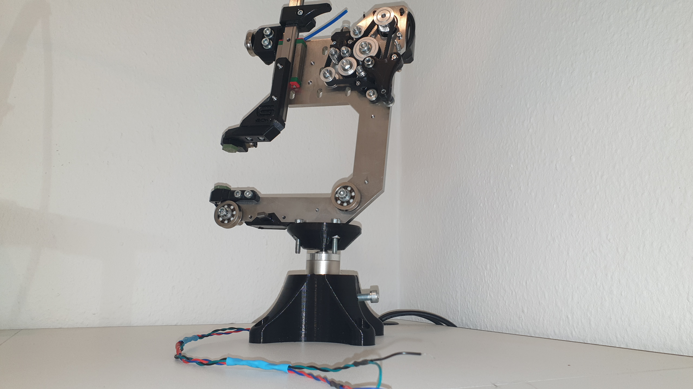
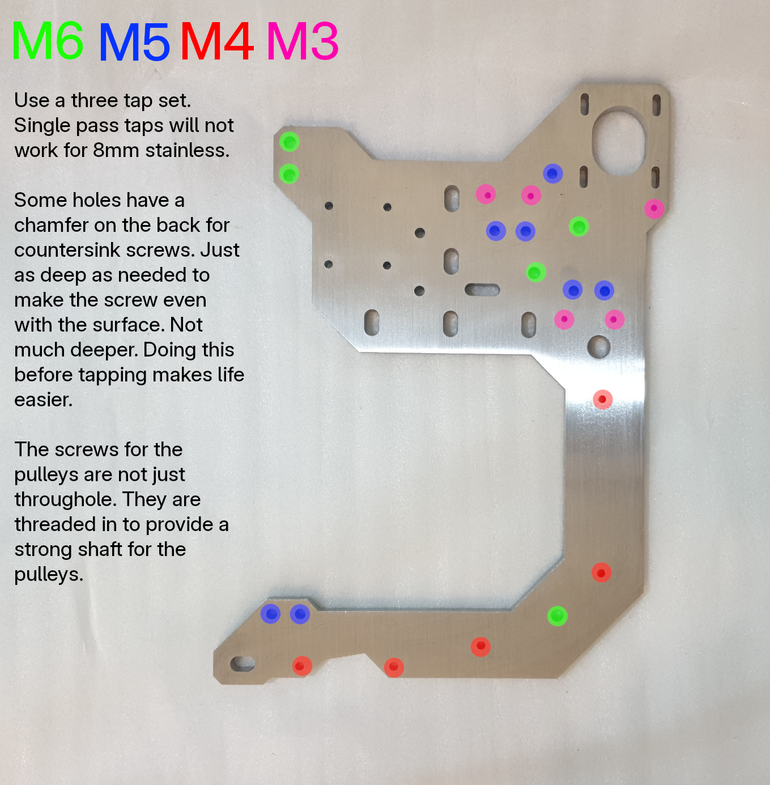

</br>
</br>
</br>


```diff
 ______     _______ ______  _______
|  ____ ___ |______ |     \ |  |  |
|_____|     |______ |_____/ |  |  |      

Gapstorm Router
```                                                               

</br>
</br>

# FreeCAD project file

[Download the G-EDM Gapstorm Router FreeCAD file](https://drive.google.com/file/d/1UKYZ6FvwNd2TUvjrRuUEfUdUrniMHqEN/view?usp=drive_link)
</br>
</br>

# About this Repo

* This Repo contains the files for the mechanical aspect of the G-EDM project. It is not fully finished and not everything is documented. A BOM for the full wire module is included but not for the router. Making the router is not so hard and the components like extrusion, tank, linear rails, ballscrews are all labeled with dimensions inside the FreeCAD project file. The BOM for the wire module is complete and building it is very straight forward. A little youtube video provides a view on the C-Arc from all perspectives.
    
</br>

[](https://www.youtube.com/watch?v=hlrt1KqOiBo)
</br>


</br>
</br>

# The Files

* The printed files for the wire module are located in the ./gapstorm-wire-module folder.
* The full router is available via google drive. File is too large to upload directly on github. It contains the fully assembled router. Follow the link below for the FreeCAD project.
</br>
</br>

[Download the G-EDM Gapstorm Router FreeCAD file](https://drive.google.com/file/d/1UKYZ6FvwNd2TUvjrRuUEfUdUrniMHqEN/view?usp=drive_link)


</br>
</br>


# Sourcing the C-Arc backbone

* The backbone is laser cut from 8mm stainless steel. Currently I don't have a project including files to create the threads and chamfer for the countersink screws. This needs to be done by hand. Follow the link below to get to the justway project.
</br>
</br>

[Stainless steel backbone from justway.com](https://www.justway.com/project/shareproject/G_EDM_Gapstorm_Wire_Module_Backbone_82de4ce1.html)


</br>
</br>

# Tools required

* It is best to drill the chamfers first to reduce the thickness and add the thread after that. Makes life easier. Also don't try single pass taps. They don't work well with 8mm stainless and are almost impossible to get straight. 3 step taps work well. It is stainless so it requires some time for that. Sometimes progress is only a tiny bit and then rotate back and so on.

* M3, M4, M5 and M6 taps are required
* 2,5mm, 3,3mm 4,2mm and 5mm drills 
* Drill or better a drillstand
* Allen keys
* Little blowtorch lighter to remelt some sections on the printed part for increased robustness
    
</br>
</br>

# Tips

* Making the threads needs to be done with care. Getting a broken tap out is very tough without a sinker EDM machine. I broke all taps from M3 to M6 just because I thought "it can take a tiny bit extra force". Take your time with that.

* All screws and washers that are submerged should be made from stainless steel. Normal screw will work but will rust quick.

* The two big bottom V-Groove bearings need a ball replacement with ceramic balls. Size and source is listed in the BOM. This is very important. Firstly the bearing itself is stainless but the balls are not and will rust in no time. And more important the bearings are mounted on the stainless frame which would make the backbone part of the conductive path. To change the balls the sealing can be removed, the palceholder pushed out, balls pushed together and the center part taken out. Replace the balls and put it back together. No hard work and doesn't require special tools.

* The GT2 idlers are very sensitive. Tightening them just a little too much will block the motion. The screws are inserted from the back with good force, then add the idlers and the shims etc. and tighten the self locking nuts just enough to make the idler stop moving along the screw but not until motion is blocked. A tiny bit extra is ok. 

* The printed inlet and outlet require good postprocessing. The inner channel should be as smooth as possible or the wire will get stuck.

* Alignment is up to the users. Basic alignment is to first ensure the bottom V Groove bearing pulls the wire in the center of the bottom nozzle. Look from below and adjust the bearing as needed until the wire is in the center. Then move the upper guide to the side and adjust to top V Groove bearing until the wire is straight. Then put the upper guide into place with the wire going through it and loosen the screws. Put the wire under tension and let the guide self adjust. The MGN15 should also be adjusted. While moving the slide up and down the wire should not move. I personally don't care about it too much. The wire should move smoothly along the nozzles without any rough or sharp feelings while pulling.
    
</br>
</br>


# Wiki (Work in progress)

[A little Wiki can be found here](https://gedm.org/wiki)

</br>
</br>

# Donations

    Become a supporter now and help accelerate development with a donation. Circuit boards, electronic components, hardware and software development are just some of the costs that need to be covered. Without the support of the community, this wouldn't be possible.
    Every supporter receives an entry with their name or alias in the credit list displayed on the firmware boot screen.
    Click the image to support the project with a little paypal donation.


[](https://www.paypal.com/donate/?hosted_button_id=QP5LHGRUCXXBL)


</br>
</br>


# Legal notes

    The author of this project is in no way responsible for whatever people do with it.
    No warranty. 

</br>   
</br>


# Credits to whom credits belong

    Thanks for the support and help to keep the project going.

    @ Tanatara
    @ 8kate
    @ Ethan Hall
    @ Esteban Algar
    @ 666
    @ td1640
    @ Nikolay
    @ MaIzOr
    @ DANIEL COLOMBIA
    @ charlatanshost
    @ tommygun
    @ renyklever
    @ Zenitheus
    @ gerritv
    @ cnc
    @ Shrawan Khatri
    @ Alex Treseder
    @ VB
    @ AndrewS
    @ TK421
    @ sarnold04

</br>   
</br>


# Responsible for the content provided

    Lautensack Roland (Germany)


</br>   
</br>


# License

    All files provided are for private use only if not declared otherwise and any form of commercial use or redistribution of the protected files is prohibited. 
